<h1 align="center">Llama Stack</h1>

<p align="center">
  <a href="https://pypi.org/project/llama_stack/"></a>
  <a href="https://pypi.org/project/llama-stack/"></a>
  <a href="https://hub.docker.com/u/llamastack"></a>
  <a href="https://github.com/meta-llama/llama-stack/blob/main/LICENSE"></a>
  <a href="https://discord.gg/llama-stack"></a>
  <a href="https://github.com/meta-llama/llama-stack/actions/workflows/unit-tests.yml?query=branch%3Amain"></a>
  <a href="https://github.com/meta-llama/llama-stack/actions/workflows/integration-tests.yml?query=branch%3Amain"></a>
  <a href="https://llamastack.github.io/docs/api-openai/conformance"></a>
  <a href="https://deepwiki.com/llamastack/llama-stack"></a>
</p>

[**Quick Start**](https://llamastack.github.io/docs/getting_started/quickstart) | [**Documentation**](https://llamastack.github.io/docs) | [**OpenAI API Compatibility**](https://llamastack.github.io/docs/api-openai) | [**Discord**](https://discord.gg/llama-stack)

**Open-source agentic API server for building AI applications. OpenAI-compatible. Any model, any infrastructure.**

<p align="center">
  
</p>

Llama Stack is a drop-in replacement for the OpenAI API that you can run anywhere — your laptop, your datacenter, or the cloud. Use any OpenAI-compatible client or agentic framework. Swap between Llama, GPT, Gemini, Mistral, or any model without changing your application code.

```python
from openai import OpenAI

client = OpenAI(base_url="http://localhost:8321/v1", api_key="fake")
response = client.chat.completions.create(
    model="llama-3.3-70b",
    messages=[{"role": "user", "content": "Hello"}],
)
```

## What you get

- **Chat Completions & Embeddings** — standard `/v1/chat/completions`, `/v1/completions`, and `/v1/embeddings` endpoints, compatible with any OpenAI client
- **Responses API** — server-side agentic orchestration with tool calling, MCP server integration, and built-in file search (RAG) in a single API call ([learn more](https://llamastack.github.io/docs/api-openai))
- **Vector Stores & Files** — `/v1/vector_stores` and `/v1/files` for managed document storage and search
- **Batches** — `/v1/batches` for offline batch processing
- **[Open Responses](https://www.openresponses.org/) conformant** — the Responses API implementation passes the Open Responses conformance test suite
- **Multi-SDK support** — use the [Anthropic SDK](https://docs.anthropic.com/en/api/messages) (`/v1/messages`) or [Google GenAI SDK](https://ai.google.dev/gemini-api/docs/interactions) (`/v1alpha/interactions`) natively alongside the OpenAI API

## Use any model, use any infrastructure

Llama Stack has a pluggable provider architecture. Develop locally with Ollama, deploy to production with vLLM, or connect to a managed service — the API stays the same.

See the [provider documentation](https://llamastack.github.io/docs/providers) for the full list.

## Get started

Install and run a Llama Stack server:

```bash
# One-line install
curl -LsSf https://github.com/llamastack/llama-stack/raw/main/scripts/install.sh | bash

# Or install via uv
uv pip install llama-stack[starter]

# Start the server (uses the starter distribution with Ollama)
uv run llama stack run starter
```

Then connect with any OpenAI, Anthropic, or Google GenAI client — [Python](https://github.com/openai/openai-python), [TypeScript](https://github.com/openai/openai-node), [curl](https://platform.openai.com/docs/api-reference), or any framework that speaks these APIs.

See the [Quick Start guide](https://llamastack.github.io/docs/getting_started/quickstart) for detailed setup.

## Resources

- [Documentation](https://llamastack.github.io/docs) — full reference
- [OpenAI API Compatibility](https://llamastack.github.io/docs/api-openai) — endpoint coverage and provider matrix
- [Getting Started Notebook](./docs/getting_started.ipynb) — text and vision inference walkthrough
- [Contributing](CONTRIBUTING.md) — how to contribute

**Client SDKs:**

|  Language |  SDK | Package |
| :----: | :----: | :----: |
| Python |  [llama-stack-client-python](https://github.com/meta-llama/llama-stack-client-python) | [](https://pypi.org/project/llama_stack_client/) |
| TypeScript   | [llama-stack-client-typescript](https://github.com/meta-llama/llama-stack-client-typescript) | [](https://npmjs.org/package/llama-stack-client) |

## Community

We hold regular community calls every Thursday at 09:00 AM PST — see the [Community Event on Discord](https://discord.com/events/1257833999603335178/1413266296748900513) for details.

[](https://www.star-history.com/#meta-llama/llama-stack&Date)

Thanks to all our amazing contributors!

<a href="https://github.com/meta-llama/llama-stack/graphs/contributors">
  
</a>
