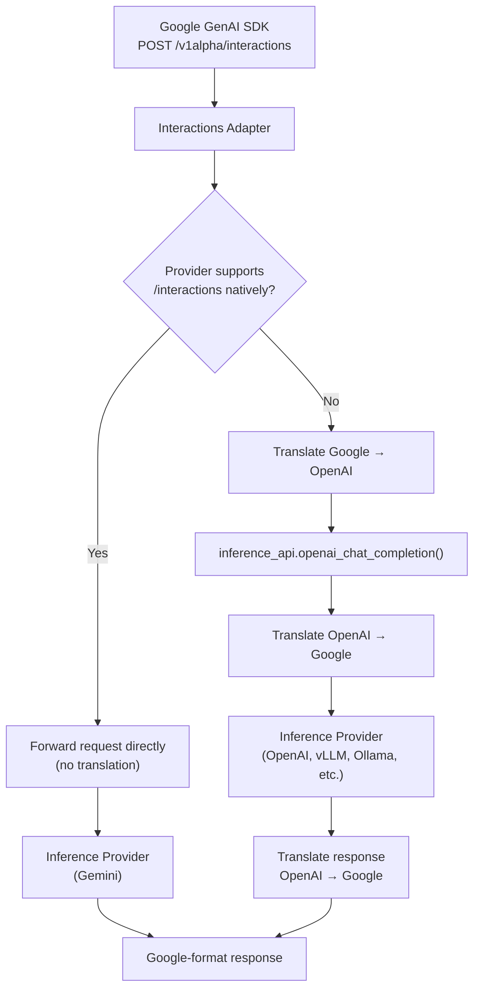

# Google Interactions API Compatibility

OGX provides a compatibility layer for the [Google Interactions API](https://ai.google.dev/gemini-api/docs/interactions) (v1alpha), so teams using the Google GenAI SDK can point at a OGX server with minimal code changes.

```python
from google import genai

client = genai.Client(
    http_options={"api_version": "v1alpha"},
    vertexai=False,
    api_key="fake",
)
# Override the base URL to point at OGX
client._api_client._url = "http://localhost:8321"

response = client.models.generate_interaction(
    model="llama-3.3-70b",
    input="Hello",
)
print(response.outputs[0].text)
```

## Implemented endpoints

| Endpoint | Method | Status |
|----------|--------|--------|
| `/v1alpha/interactions` | POST | Implemented |
| `/v1alpha/interactions/{id}` | GET | Not yet |
| `/v1alpha/interactions/{id}` | DELETE | Not yet |
| `/v1alpha/interactions/{id}/cancel` | POST | Not yet |

For property-level coverage details, see the [conformance report](/docs/api-google-interactions/conformance).

## How it works

The Interactions adapter checks whether the configured inference provider natively supports the `/v1alpha/interactions` endpoint. If it does, the request is forwarded directly. Otherwise, the adapter translates between Google and OpenAI formats.



**Translation path** (most providers): the adapter converts the full request and response between formats:

- **Text generation** with string or multi-turn conversation input
- **Streaming** via Server-Sent Events matching Google's event format
- **System instructions** mapped to the system role
- **Generation config** parameters (temperature, top_p, top_k, max_output_tokens)

**Passthrough path** (Gemini): when using the Gemini inference provider, non-streaming requests are forwarded directly to Google's API without translation.

## Known limitations

- Only text content is supported; multimodal inputs (images, audio, video) are not yet implemented
- Tool declarations (Function, GoogleSearch, CodeExecution, MCP) are not yet supported
- Background execution and interaction storage (`store`, `background`) are not available
- The GET, DELETE, and Cancel endpoints are not yet implemented
- Response modalities are accepted for compatibility but ignored
