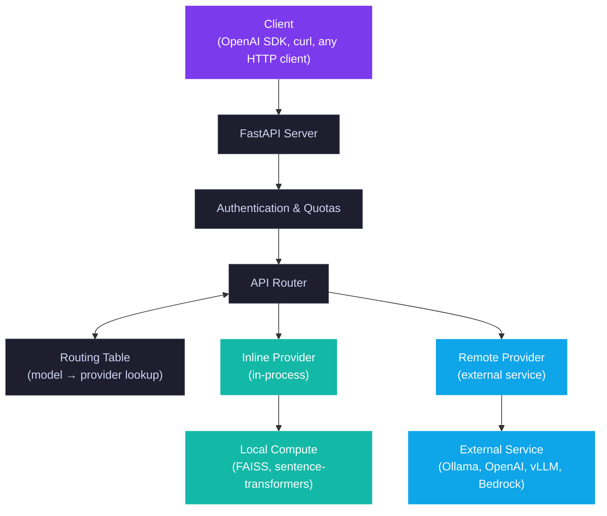

# Architecture

Llama Stack is a server that exposes a unified, OpenAI-compatible API for AI capabilities: inference, responses, safety, vector storage, and more. It is provider-agnostic - the same API works whether the backend is Ollama, OpenAI, vLLM, Bedrock, or dozens of other services.


## Two Packages

The codebase is split into two packages:

- **`llama-stack-api`** - Lightweight package with API protocol definitions, Pydantic data types, and provider specs. No server code. Third-party providers depend only on this.
- **`llama-stack`** - The server: provider resolution, routing, storage, CLI, and all built-in providers.

## Request Flow



**Example**: `POST /v1/chat/completions` with `model: "ollama/llama3.2:3b"`:

1. FastAPI dispatches to the inference router
2. `InferenceRouter` calls `routing_table.get_provider_impl("ollama/llama3.2:3b")`
3. The routing table finds the model belongs to the `ollama` provider
4. The router delegates to the Ollama provider's `openai_chat_completion()` method
5. The provider forwards to the Ollama server and streams the response back

## Provider Architecture

Providers come in two types:

| Type | Example | How it works |
|------|---------|--------------|
| **Inline** (`inline::`) | `inline::faiss`, `inline::sentence-transformers` | Runs in the Llama Stack process |
| **Remote** (`remote::`) | `remote::ollama`, `remote::openai` | Adapts an external service |

Each provider declares which API it implements, its config class, and its dependencies. The provider registry (`src/llama_stack/providers/registry/`) lists all available providers per API.

### Auto-Routing

Many APIs use automatic routing so multiple providers can serve different resources through the same API:

| Routing Table | Router | Purpose |
|--------------|--------|---------|
| `Api.models` | `Api.inference` | Route to correct inference provider per model |
| `Api.shields` | `Api.safety` | Route to correct safety provider per shield |
| `Api.vector_stores` | `Api.vector_io` | Route to correct vector store provider |
| `Api.tool_groups` | `Api.tool_runtime` | Route to correct tool runtime |

This means you can have Ollama serving one model and OpenAI serving another, both accessible through the same `/v1/chat/completions` endpoint.

## Configuration

A run config YAML defines everything about a running instance:

```yaml
version: 2
distro_name: starter
providers:
  inference:
    - provider_id: ollama
      provider_type: remote::ollama
      config:
        base_url: ${env.OLLAMA_URL:=http://localhost:11434/v1}
    - provider_id: openai
      provider_type: remote::openai
      config:
        api_key: ${env.OPENAI_API_KEY}
```

Key features:
- **Environment variable substitution**: `${env.VAR:=default}`
- **Conditional providers**: `${env.API_KEY:+provider_id}` enables a provider only when a variable is set
- **Multiple providers per API**: both Ollama and OpenAI can serve inference, each handling different models

## Distributions

A distribution is a pre-configured run config for a target environment. Think Kubernetes distributions (AKS, EKS, GKE) - the API stays the same, each distribution wires different backends.

| Distribution | Use case |
|-------------|----------|
| `starter` | General purpose, supports most providers |
| `dell`, `nvidia` | Hardware-specific optimizations |
| Custom | Build your own with `llama stack build` |

## Storage

Llama Stack persists state (registered models, conversation history, vector stores) using pluggable storage backends:

| Backend | Use case |
|---------|----------|
| SQLite | Default, single-node development |
| PostgreSQL | Production deployments |
| Redis | Multi-node caching |

Storage is configured in the run config and shared across all providers.
