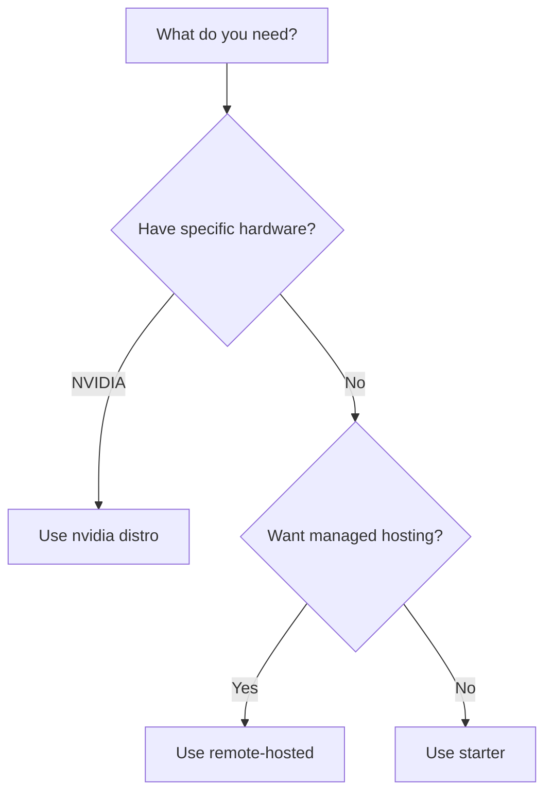

# Available Distributions

| Distribution | Use Case | Inference |
|-------------|----------|-----------|
| `starter` | General purpose, prototyping, production | Ollama, OpenAI, vLLM, Bedrock, and more |
| `nvidia` | NVIDIA NeMo Microservices | NVIDIA NIM |
| Custom | Your own provider mix | Any supported provider |

## Starter (Recommended)

The starter distribution works for most use cases. It includes all providers and auto-enables them based on available environment variables:

```bash
uv run llama stack run starter
```

It supports local inference (Ollama), cloud providers (OpenAI, Bedrock, Azure, etc.), and everything in between. See the [Starter Guide](self_hosted_distro/starter) for details.

## NVIDIA

Optimized for NVIDIA NeMo Microservices. See the [NVIDIA Guide](self_hosted_distro/nvidia).

## Passthrough

A minimal distribution that forwards requests to a remote Llama Stack server. See the [Passthrough Guide](self_hosted_distro/passthrough).

## Remote-Hosted

Some partners host Llama Stack endpoints that you can connect to directly. See [Remote-Hosted Distributions](./remote_hosted_distro/) for available options.

## Custom

Build your own distribution when you need a specific provider mix. See [Building Custom Distributions](./building_distro).


